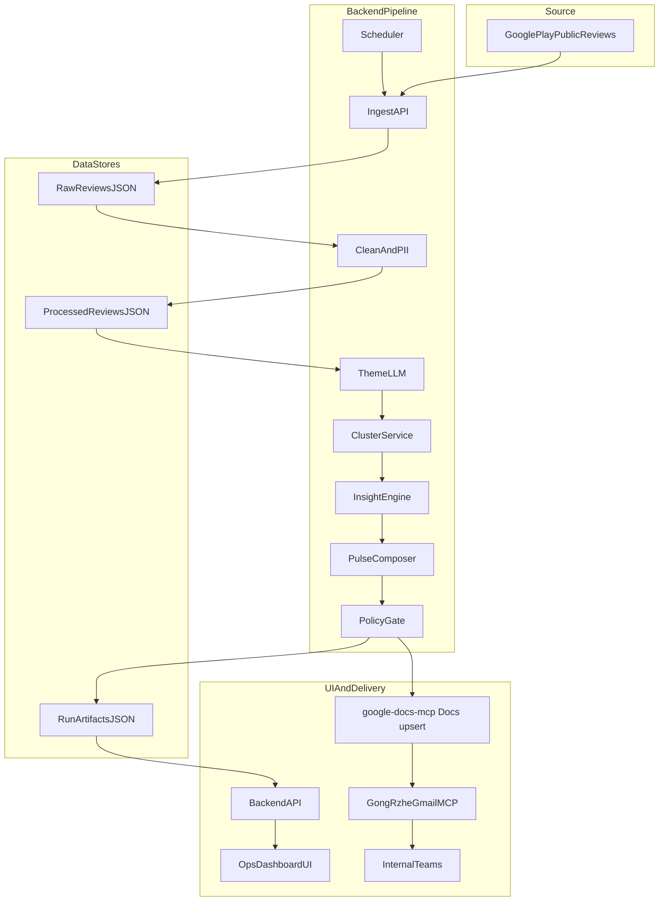
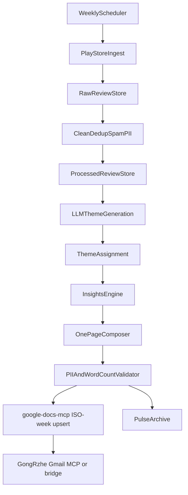

# Groww Play Store Reviews -> Weekly Product Pulse

## Objective
Build an automated weekly system that converts recent Groww Google Play Store reviews into a concise, one-page product pulse for internal teams.

## Scope and Constraints
- Data source: public Google Play reviews for `com.nextbillion.groww`
- Time range: rolling last 12 weeks
- Required fields per review: rating, review text, date, helpful_count
- Output note length: max 250 words
- Theme constraints: exactly 5 themes, never more than 5
- Privacy: no PII in generated outputs
- Delivery: **upsert** weekly content into one persistent Google Doc via [**@a-bonus/google-docs-mcp**](https://github.com/a-bonus/google-docs-mcp) (stdio from Phase 5): **one ISO-week block per `YYYY-Www`** (derived from the pulse report date); repeat runs for the same week **update in place** (`deleteRange` + `insertText`), new weeks **page-break + append**. Then email via [**GongRzhe Gmail MCP Server**](https://github.com/GongRzhe/Gmail-MCP-Server) (stdio, npm: `@gongrzhe/server-gmail-autoauth-mcp`) or HTTP `mcp_bridge` fallback for Gmail (Docs HTTP bridge remains append-only).

## System Architecture (Phase-wise)

## High-Level Architecture Diagram (Readable View)


## Backend vs Frontend Scope
- Backend phases: Phase 1 to Phase 6
- Frontend/UI phase: Phase 7

### Phase 1 (Backend): Foundation + Ingestion + Cleaning (Combined)
- Define run cadence: weekly scheduled execution.
- Configure core parameters:
  - `app_id`: `com.nextbillion.groww`
  - `lookback_weeks`: `12` (fixed)
  - `top_reported_themes`: `3` (shown in weekly pulse)
  - `max_themes`: `5` hard cap
  - `theme_count`: `5` (fixed)
  - `email_recipient`: predefined alias/self
- Establish policy gates:
  - max 250 words
  - no PII leakage
  - exactly 3 quotes and 3 action ideas
- Tech:
  - Runtime: Python 3.11+
  - Config: `.env` + Pydantic Settings
  - API contracts: JSON Schema for LLM responses
- Data validation:
  - Validate fixed constraints at startup (`lookback_weeks=12`, `theme_count=5`, `top_reported_themes=3`).
  - Fail fast on missing/invalid required config values.
- Logging:
  - Log run start/end, config snapshot (non-secret), and policy gate values.
  - Include a run identifier and UTC timestamps in all Phase 1 artifacts.
- Error handling:
  - On config validation failure, stop downstream execution and write failure details to `config_check.json`.
  - Ensure partial failures do not silently continue to later phases.
- Manual output to verify:
  - `phase1_pipeline/outputs/config_check.json` showing effective config and policy thresholds

#### Phase 1.1: Data Ingestion (Within Phase 1)
- Use a public Play Store reviews API/library (no auth-gated scraping).
- Fetch latest reviews and filter to configured date window.
- Store data in two layers for auditability:
  - raw reviews (as fetched)
  - processed reviews (post-cleaning)
- Raw review JSON is stored in descending order by `date` (latest posted reviews first).
- Tech:
  - API/library: `google-play-scraper` (public data only)
  - Storage: JSON file (`phase1_pipeline/outputs/raw_reviews.json`)
  - Job entrypoint: FastAPI internal endpoint or CLI job
- Data validation:
  - Validate each ingested record has `review_id`, `rating`, `text`, `date`, `helpful_count`, `ingested_at`.
  - Enforce type checks (`rating`/`helpful_count` numeric, `date` ISO format).
  - Validate output ordering by latest `date` before write.
- Logging:
  - Log fetched count, inserted count, dropped count, date range, and source app id.
  - Log if batching/retries are used during fetch calls.
- Error handling:
  - Capture API/network failures with retry/backoff and explicit failure reason in ingestion report.
  - If write fails, preserve fetched data in-memory run report and mark run as failed.
- Manual output to verify:
  - `phase1_pipeline/outputs/ingestion_report.json` with fetched count, min/max review date, sample 5 records

**Review data contract**
- `review_id` — prefer native Play Store **`reviewId`** when present; otherwise a deterministic hash from rating + text + date
- `rating`
- `text`
- `date`
- `helpful_count` (example: "2 people found this review helpful")
- `ingested_at`

#### Phase 1.2: Cleaning, Deduplication, and Spam Filtering (Within Phase 1)
- Text normalization:
  - whitespace cleanup
  - URL/noise cleanup
  - standard normalization for downstream NLP
- Language and quality filter rules (strict):
  - Keep only reviews where detected language is English (`en`).
  - Filter out any review tagged as non-English, even if written in English letters (transliteration/Roman script).
  - Filter out very short reviews with word count `< 5` after normalization.
- Dedup and spam rules (deterministic):
  - Exact duplicate: same normalized text hash -> keep oldest by date, omit the rest.
  - Near duplicate: text similarity above threshold (for example >= 0.92) -> keep one canonical review.
  - Spam/promo pattern: repetitive referral/promo content, link-only content, or non-informative noise -> omit.
- Dedup strategy:
  - exact dedup by normalized hash
  - near-duplicate removal by similarity threshold
- Spam filtering:
  - very short/noise-only text
  - repetitive/promotional patterns
- Examples of filtered-out reviews:
  - Language filter:
    - "bahut accha app hai" -> filtered (non-English language, Roman script)
    - "kya bakwas app" -> filtered (non-English language, Roman script)
  - Minimum words filter:
    - "Bad" -> filtered (1 word)
    - "Very slow" -> filtered (2 words)
    - "App not opening" -> filtered (3 words)
    - "Worst app ever" -> filtered (3 words)
  - Spam/noise filter:
    - "Use my code ABC123 for bonus" -> filtered (promotional/referral)
    - "http://short.link/xyz" -> filtered (link-only)
    - "!!!!!!!!!" -> filtered (noise-only)
  - Duplicate filter:
    - repeated text "App crashes every login" posted multiple times -> keep one, filter duplicates
- Examples of reviews kept:
  - "Portfolio page takes 8-10 seconds to load after latest update."
  - "Support closed my ticket without resolving KYC verification issue."
  - "Charts are useful, but app freezes when switching between stocks."
- PII scrubbing before LLM:
  - redact emails, phone numbers, account-like identifiers
- Omitted reviews handling:
  - store omitted reviews (deduped, spam, invalid quality) in an audit store for manual review
- Tech:
  - NLP preprocessing: `regex` + `rapidfuzz` + optional `clean-text`
  - Language detection: `langdetect` or `fastText` language ID
  - Processed store: JSON (`phase1_pipeline/outputs/processed_reviews.json`)
  - Omitted review store: JSON (`phase1_pipeline/outputs/omitted_reviews.json`)
  - PII patterns: regex-based detector with replacement tokens
- Data validation:
  - Validate cleaned rows preserve required fields (`review_id`, `text`, `date`, `rating`).
  - Validate omission reason is mandatory for every omitted row.
  - Validate `processed_count + omitted_count == raw_count`.
- Logging:
  - Log per-rule drop counts (`non_english`, `short_text_lt_5_words`, `spam_or_promo`, duplicates).
  - Log dedup thresholds and language-detection settings used in run.
- Error handling:
  - On malformed input rows, move row to omitted with `invalid_record` reason instead of crashing full run.
  - If cleaning artifact write fails, emit failure status and stop Phase 2 trigger.
- Manual output to verify:
  - `phase1_pipeline/outputs/cleaning_report.json` with dedup removed, spam removed, pii_redactions, omitted_count
  - `phase1_pipeline/outputs/omitted_reviews_sample.json` with omission reason (`non_english`, `short_text_lt_5_words`, `spam_or_promo`, `exact_duplicate`, `near_duplicate`)

### Phase 2 (Backend): Theme Generation (LLM)
- Input: `phase1_pipeline/outputs/processed_reviews.json` (cleaned review corpus in the lookback window).
- Output requirement:
  - generate exactly 5 high-level themes
  - each theme must be 1-3 words
- Review-level tagging requirement (included in Phase 2):
  - assign each processed review to one primary theme from the generated 5 themes (all processed reviews must be tagged)
  - output must include `review_id`, `text`, and `primary_theme` for auditability
- Enforce strict schema output (JSON) and retry on malformed/oversized theme list.
- Tech:
  - LLM API: Groq API
  - Prompting: constrained JSON output with validation/retry
  - Storage: JSON artifact (`phase2_theming/outputs/theme_runs_<week>.json`)
- Data validation:
  - Enforce exactly 5 unique themes, each 1-3 words.
  - Validate all processed reviews are assigned a `primary_theme` in review-theme map.
  - Validate `sum(theme_summary_counts) == review_count`.
- Logging:
  - Log batch count, per-batch attempts, retry reasons, model used, and reviews processed.
  - Log final theme list and per-theme mapped counts.
- Error handling:
  - Retry on transient API failures and rate limits with backoff.
  - Fail run on schema violations after retries (do not emit partial themes as pass).
  - Persist run-level failure artifact with actionable error message.
- Manual output to verify:
  - `phase2_theming/outputs/themes_<week>.json` containing exactly 5 short themes and `theme_summary_counts`
  - `phase2_theming/outputs/review_theme_map_<week>.json` mapping each review to one theme

### Phase 3 (Backend): Review Clustering (Primary Theme Assignment)
- Validate and optimize the Phase 2 review-theme mapping.
- Recommended approach:
  - Groq LLM classifier for primary theme assignment
  - second-pass Groq classification for ambiguous or low-confidence cases
- Balance control:
  - detect over-dominant theme
  - second-pass reassignment of borderline items to preserve distribution quality
- Tech:
  - LLM API: Groq API
  - Classification: constrained JSON output (`primary_theme` from fixed 5-theme set)
  - Storage: JSON (`phase3_clustering/outputs/review_theme_map.json`)
- Data validation:
  - Validate one and only one `primary_theme` per review after rebalancing.
  - Validate all assigned themes belong to the fixed 5-theme set.
  - Validate cluster distribution totals match input review count.
- Logging:
  - Log classifier confidence bands, tie-break decisions, and number of reassigned reviews.
  - Log pre/post rebalancing theme distributions.
- Error handling:
  - If Groq classification call fails, fallback to deterministic rule-based assignment and flag degraded mode.
  - Abort phase if mapping integrity checks fail.
- Manual output to verify:
  - `phase3_clustering/outputs/review_theme_map.json` (rebalanced/final mapping)
  - `phase3_clustering/outputs/cluster_distribution.json` showing per-theme counts and dominance checks

### Phase 4 (Backend): Insights + One-Page Composition (Integrated)
- Compute per-theme metrics:
  - frequency
  - sentiment (average polarity / negative share)
  - week-over-week trend delta (optional but preferred)
- Rank top 3 themes (from the fixed 5-theme set) via weighted score:
  - `score = w1*frequency + w2*negative_intensity + w3*trend_delta`
- Extract:
  - 3 representative user quotes (sanitized, no PII)
  - 3 actionable product insights linked to top pain points
- Render fixed structure:
  - Weekly Groww Product Pulse
  - Top Themes (3 bullets selected from 5 generated themes)
  - User Voice (3 quotes)
  - Action Ideas (3 bullets)
- Composition approach:
  - Gemini Flash 2.5 generates the one-page narrative from the same phase's structured insight outputs.
  - Use a role-based system prompt to control writing style and output behavior.
  - Prompt enforces concise, decision-oriented bullet style and strict section format.
  - Action Ideas are synthesized by Gemini Flash 2.5 from top-ranked themes + user voice quotes.
- Sample system prompt (copy-ready):
```text
You are a senior product analyst writing a weekly internal product pulse for Product, Growth, Support, and Leadership teams.

Your job is to convert structured review insights into a concise, decision-oriented one-page note.

Hard constraints:
1) Output must be <= 250 words.
2) Output must include exactly these sections in order:
   - Weekly Groww Product Pulse
   - Top Themes
   - User Voice
   - Action Ideas
3) Top Themes must contain exactly 3 bullets.
4) User Voice must contain exactly 3 quote bullets.
5) Action Ideas must contain exactly 3 bullets.
6) Do not include any PII (names, emails, phone numbers, IDs, account numbers, ticket IDs).
7) Keep language crisp, scannable, and action-focused. Avoid generic filler.
8) Do not invent facts. Use only provided inputs.

Style rules:
- Prefer short bullets over long paragraphs.
- Use plain business language.
- Highlight what changed or matters this week.
- Make action ideas specific and implementable by product teams.

If any required input is missing, return:
ERROR: MISSING_REQUIRED_INPUT
```
- Enforce length:
  - hard validator for <=250 words
  - compression pass if needed
- Final privacy scan before publication.
- Tech:
  - Sentiment: `vaderSentiment` or transformer-based classifier
  - Ranking: weighted scoring in Python
  - LLM API: Gemini Flash 2.5
  - Prompting: role-based system prompt + constrained markdown generation with section and bullet-count constraints
  - Validation: word counter + PII validator
  - Storage (structured): JSON (`phase4_insights/outputs/insights_<week>.json`)
  - Storage: Markdown artifact (`phase4_insights/outputs/pulse_<week>.md`)
- Data validation:
  - Validate top themes are selected from the approved 5-theme set only.
  - Validate exactly 3 quotes and 3 action items are produced before composition.
  - Validate quotes pass PII checks and are non-empty.
  - Validate output structure sections are present in required order.
  - Validate max 250-word constraint and no PII leakage.
  - Validate exactly 3 top-theme bullets, 3 quotes, and 3 action ideas.
- Logging:
  - Log scoring components per theme (frequency, sentiment, trend).
  - Log quote selection source theme and filtering/redaction actions.
  - Log final word count, section completeness checks, and any compression passes applied.
  - Log PII scan results (match count only, no sensitive values).
- Error handling:
  - If sentiment/trend components fail, fallback to frequency-only ranking and flag in run metadata.
  - Skip invalid quotes/actions and regenerate until constraints are met or fail explicitly.
  - On validation failure, run one automatic LLM rewrite/compression pass before failing.
  - If still invalid, block downstream email phase and record failure reason.
- Manual output to verify:
  - `phase4_insights/outputs/insights_<week>.json` with 5 generated themes, top 3 ranked themes, 3 quotes, 3 actions
  - `phase4_insights/outputs/pulse_<week>.md` that follows exact structure and <=250 words

### Phase 4.5 (Backend): Mutual Fund Fee Scraper (Exit Load / Fee Context)
- Purpose:
  - Pull a small public-data “fee context” snapshot from Groww mutual fund pages (no auth) to support internal interpretation of review themes around “fees/charges” (optional context layer).
  - This is a standalone artifact; Phase 4 note generation can optionally reference it later if needed.
- Input:
  - Static list of fund source URLs (public Groww pages) embedded in code.
- Output:
  - `phase4_5_fee_scraper/outputs/mf_fee_data_<week>.json`
- Tech:
  - Runtime: Python 3.11+
  - HTTP: `requests`
  - Parsing: `beautifulsoup4` + `lxml` + JSON extraction from `__NEXT_DATA__` where available
  - Render fallback: Playwright (Chromium) when Groww serves JS-only shell pages
- Data validation:
  - Validate the fund list size and that each result includes `fund_name`, `status`, `source_url`, `last_scraped`.
  - Validate `exit_load_bullets` is a list of strings for successful scrapes.
  - Validate `scraped_count + failed_count == total_funds`.
- Logging:
  - Log fetch method (`requests` vs `playwright`) and parse method (`next_data` vs `html_table`) per fund.
  - Log per-fund failures with last error and overall run status (`pass`/`partial`/`fail`).
- Error handling:
  - Retry Playwright fetch with bounded attempts/backoff when enabled.
  - If one fund fails, continue scraping remaining funds and mark run `partial`.
  - If all funds fail, mark run `fail` and still write the output artifact for audit.
- Manual output to verify:
  - `phase4_5_fee_scraper/outputs/mf_fee_data_<week>.json`

### Phase 5 (Backend): Email Draft and MCP Delivery
- Delivery model:
  - Maintain one persistent Google Doc as the weekly pulse ledger.
  - **Idempotent ISO week blocks (stdio MCP):** each run derives `week_id` as `YYYY-Www` from the pulse **report date** (`YYYY-MM-DD`). The doc body includes delimited sections:
    - `===== WEEK: YYYY-Www =====` … content … `===== END WEEK: YYYY-Www =====`
  - If that `week_id` already exists → **deleteRange + insertText** at the same span (update in place, **no** duplicate page).
  - If it does not exist → **insertPageBreak** (when the doc already has body content) then **appendText** (new week only).
  - Email runs **only after** a successful Doc write, body includes the same formatted section + Doc link.
  - Internal combined JSON artifact is still generated for audit (`combined_payload_<week>.json`), but **human-facing output is markdown/plain text**, not raw JSON.
  - Optional env **`GDOCS_LAST_WEEK_CACHE`**: path to a small JSON file recording last `{ doc_id, week_id }` (debug/ops only).
- **Google Docs (primary):** [**a-bonus/google-docs-mcp**](https://github.com/a-bonus/google-docs-mcp) — the same MCP server used with Cursor/Claude (`npx -y @a-bonus/google-docs-mcp`), driven from Python via the **MCP stdio client** (see `phase5_delivery/src/gdocs_google_mcp_stdio.py`). **Pure idempotency helpers** (markers, plain-text span math, ISO `week_id`): `phase5_delivery/src/gdocs_weekly_idempotent.py` (unit tests: `phase5_delivery/tests/test_gdocs_weekly_idempotent.py`).
  - Auth (per upstream): OAuth desktop client (`GOOGLE_CLIENT_ID` / `GOOGLE_CLIENT_SECRET`, run `npx -y @a-bonus/google-docs-mcp auth` once) **or** Workspace **service account** + `SERVICE_ACCOUNT_PATH` / delegation (`GOOGLE_IMPERSONATE_USER`) as documented in that repo.
  - MCP tools used (stdio): `readDocument` (`format=json`), `deleteRange`, `insertText`, `insertPageBreak`, `appendText`. Set **`GOOGLE_DOC_ID`** to an existing doc (recommended); if it is empty the client raises a clear config error instead of calling `createDocument` (which often returns *Permission denied*). Optional: `GDOCS_AUTO_CREATE=1` restores automatic `createDocument`.
  - **HTTP fallback:** `mcp_bridge` `POST /docs/append` still performs a simple append (no week-id upsert). Prefer **stdio** for idempotent weekly updates.
- **Gmail:** [**GongRzhe/Gmail-MCP-Server**](https://github.com/GongRzhe/Gmail-MCP-Server) — MCP tools `draft_email` / `send_email` (OAuth; install auth via `npx -y @gongrzhe/server-gmail-autoauth-mcp auth`, credentials under `~/.gmail-mcp/` per upstream). The upstream GitHub repo is **archived** as of 2026; the published npm package is still used the same way as in Cursor. Phase 5 drives it over **stdio** (see `phase5_delivery/src/gmail_gongrzhe_mcp_stdio.py`) when `GMAIL_MCP_TRANSPORT=stdio`.
  - **HTTP fallback:** `GMAIL_MCP_TRANSPORT=http` + `GMAIL_MCP_ENDPOINT` pointing at **`mcp_bridge`** `POST /gmail/deliver` (service account / Workspace) for CI or when you do not run the Node Gmail MCP subprocess.
- Subject format:
  - `Groww Weekly Product Pulse - <Week/Date>`
- Delivery modes:
  - `draft_only` for safe testing
  - `send` for production runs
- Tech:
  - Docs: Python [`mcp`](https://github.com/modelcontextprotocol/python-sdk) SDK + stdio (`npx -y @a-bonus/google-docs-mcp`) when `GDOCS_MCP_TRANSPORT=stdio`; **`GDOCS_MCP_TRANSPORT=http`** uses `mcp_bridge` or local fallback (default in code favors `http` for environments without Node).
  - Gmail: Python `mcp` SDK + stdio (`npx -y @gongrzhe/server-gmail-autoauth-mcp`) when `GMAIL_MCP_TRANSPORT=stdio`; **`GMAIL_MCP_TRANSPORT=http`** uses `mcp_bridge` + Gmail API
  - Audit: doc id, section title, delivery status in `phase5_delivery/outputs/email_runs_<week>.json`
  - Stdio doc tool result may include `gdocs_action` (`update` vs `append`), `week_id` (`YYYY-Www`), `plain_len_before` / `plain_len_after`, and `status` `doc_updated` or `doc_appended`.
- Data validation:
  - Validate subject format `Groww Weekly Product Pulse - <Week/Date>`.
  - Validate body is sourced from latest validated artifacts only:
    - Phase 4 insights (`phase4_insights/outputs/insights_<week>.json`)
    - Phase 4.5 fee snapshot (`phase4_5_fee_scraper/outputs/mf_fee_data_<week>.json`) when available
  - Validate recipient allowlist when configured.
  - With `GDOCS_MCP_TRANSPORT=stdio`, validate Google auth material (OAuth **or** service account path) before running.
  - With `GMAIL_MCP_TRANSPORT=stdio`, validate Gmail OAuth token file exists (`~/.gmail-mcp/credentials.json` or `GMAIL_CREDENTIALS_PATH`).
  - Validate combined JSON payload (audit artifact) is valid JSON and contains required keys before doc write; human-facing doc/email body is **formatted plain text** inside week markers, not raw JSON.
  - Validate human-facing body includes required pulse sections (`Top Themes`, `User Voice`, `Action Ideas`) and optional `Fee Explainer` when selected.
- Logging:
  - Log transport (`stdio` vs `http`), draft/send mode, doc id, Gmail message id, MCP/tool errors (text only).
- Error handling:
  - Retry transient failures with bounded backoff (HTTP and stdio subprocess retries).
  - Doc write failure (append or in-place update) → `doc_append_failed`, **no** email send.
- Manual output to verify:
  - `phase5_delivery/outputs/email_delivery_report.json`
  - `phase5_delivery/outputs/doc_append_report_<week>.json` (despite the name, covers both upsert paths; check tool attempts / result metadata)
  - `phase5_delivery/outputs/combined_payload_<week>.json` (**audit / structured snapshot**; may include `fee_funds` per selected MFs in UI flows — the Doc still stores the formatted weekly text + fee explainer, not this JSON blob)

### Phase 6 (Backend): Orchestration, Observability, and QA
- Weekly scheduler triggers full pipeline.
- Per-run logs:
  - fetched count, cleaned count, dedup removed, spam removed
  - theme distribution
  - sentiment summary
  - word count and pii redaction count
  - email delivery result
- Quality gates before send:
  - themes count is exactly 5
  - exactly 3 quotes and 3 actions
  - note length <=250 words
  - PII check passes
- Fail-safe:
  - block send on policy failure
  - store artifacts and error reason for review
- Tech:
  - Orchestration: **GitHub Actions scheduled workflow only** (no cron / no APScheduler)
  - Workflow file: `.github/workflows/weekly_pulse.yml`
  - GitHub Actions secrets/env required (minimum):
    - `GROQ_API_KEY`: required for Phase 2 and Phase 3 (Groq LLM calls)
    - `GEMINI_API_KEY`: required for Phase 4 (Gemini Flash 2.5)
  - GitHub Actions runner prerequisites (minimum):
    - Python 3.11+ available
    - Node.js available (so `npx` can run MCP servers in Phase 5)
    - Phase 5 MCP OAuth tokens are pre-created and persist on the runner machine:
      - Google Docs MCP tokens: `~/.config/google-docs-mcp/`
      - Gmail MCP tokens: `~/.gmail-mcp/`
  - Runner requirement for MCP delivery:
    - Phase 5 uses **stdio MCP** (`npx ...`) and relies on persisted OAuth tokens in the runner home directory:
      - Google Docs MCP tokens: `~/.config/google-docs-mcp/`
      - Gmail MCP tokens: `~/.gmail-mcp/`
    - Recommended: use a **self-hosted GitHub Actions runner** (so tokens can persist) for end-to-end Phase 5.
    - If using GitHub-hosted runners, Phase 5 will not be able to perform interactive OAuth; delivery will fail unless you change delivery auth strategy.
  - Observability: structured logs + lightweight metrics dashboard
  - QA: pre-send assertions as automated checks
- Data validation:
  - Validate inter-phase artifact contracts before each phase starts.
  - Validate run completeness (all required outputs present and parseable).
- Logging:
  - Centralize phase-level status, duration, counts, and failure reasons under one run id.
  - Emit success/failure summary per scheduled run.
- Error handling:
  - Short-circuit downstream phases when upstream validation fails.
  - Support safe reruns with idempotent artifact overwrite behavior.
- Manual output to verify:
  - `phase6_ops/outputs/run_summary_<week>.json` with pass/fail for all quality gates

### Phase 7 (Frontend/UI): Send console (minimal)
- Purpose: operator-only screen to deliver the weekly note + fee explainer.
- UI shows **only**:
  - Multi-recipient email input (comma/newline separated).
  - Mutual fund **multi-select** (choose 1, 2, 3, … or all) from latest Phase 4.5 snapshot, plus **Select all funds** and **Clear selection**.
  - One primary action: append to Google Doc, then send to all listed recipients (body uses **Fee Explainer** layout from Output Template).
  - Below the action button, show two preview cards in one row:
    - left card: weekly pulse preview
    - right card: fee explainer preview (scrollable when multiple funds are selected)
- Tech:
  - Frontend: Streamlit (`phase7_ui/app.py`).
  - Delivery: reuses Phase 5 helpers (same **doc upsert** + Gmail MCP path as automated `run_phase5`). Multi-recipient UI sends call Gmail with **`mode=send`** explicitly (independent of `DELIVERY_MODE` in `.env` for that button path).
  - Optional: FastAPI artifact endpoints (`phase7_ui/api.py`) for tooling; not required for the send console.
- Data validation:
  - Block send on invalid email tokens.
  - Phase 4 insights must be `pass` when building the combined body (`load_phase4_insights`).
- Logging:
  - UI-triggered sends append to `phase7_ui/outputs/ui_delivery_runs.jsonl`.
  - Load/delivery errors append to `phase7_ui/outputs/ui_load_errors.log`.
- Manual output to verify:
  - UI preview cards show exact content the user should expect in email/doc.
  - Doc receives weekly pulse + **Fee Explainer** blocks; each selected fund repeats: fund name, three bullets, `Links:` URL.

## High-Level Data Flow


## Output Template (Target Format)
**Weekly Groww Product Pulse**

**Top Themes**
- Theme 1: short insight
- Theme 2: short insight
- Theme 3: short insight

**User Voice**
- "Quote 1"
- "Quote 2"
- "Quote 3"

**Action Ideas**
- Action 1
- Action 2
- Action 3

**Fee Explainer** (optional; one block per selected mutual fund)

Fund Name A

- Fee-related bullet 1
- Fee-related bullet 2
- Fee-related bullet 3

Links: https://...

Fund Name B

- Fee-related bullet 1
- Fee-related bullet 2
- Fee-related bullet 3

Links: https://...

### Google Doc ledger envelope (Phase 5 idempotency)
What is **actually stored** in the shared Google Doc is the formatted note above, wrapped for **ISO-week upsert** (stdio MCP):

```text
===== WEEK: YYYY-Www =====
Groww Weekly Product Pulse - YYYY-MM-DD
... pulse + fee explainer body ...
===== END WEEK: YYYY-Www =====
```

- `YYYY-Www` comes from the pulse **report date** (`pulse_<date>.md` / `YYYY-MM-DD`) via the ISO calendar.
- Reruns in the same week **replace** the span between these markers; a **new** week **appends** (after an optional page break if the doc is non-empty).

## Suggested Delivery Milestones
- Week 1: ingestion + cleaning + storage + scheduler
- Week 2: LLM theming + clustering + ranking logic
- Week 3: integrated insights + one-page composition + policy validators
- Week 4: Google Docs **idempotent ISO-week ledger** + Gmail MCP + observability + end-to-end hardening

## Deployment (Vercel)
- Target deployment model:
  - Frontend (Phase 7 UI): deploy on Vercel.
  - Backend APIs/orchestration endpoints: deploy on Vercel serverless functions.
- Frontend on Vercel:
  - Production “ops” UI may be a Next.js (or similar) app that talks to the same artifact API patterns as `phase7_ui/api.py`.
  - The **current** Phase 7 reference implementation is a **minimal Streamlit send console** (recipients, MF multi-select, dual preview cards, upsert+send) — not a full metrics dashboard unless you extend it.
- Backend on Vercel:
  - Expose API routes for triggering/reading pipeline runs and artifacts.
  - Run pipeline phase scripts through backend job endpoints and persist artifacts in storage accessible to Vercel functions.
- Scheduler (GitHub Actions only):
  - Weekly scheduling is handled **only** by GitHub Actions (Phase 6), not Vercel Cron.
  - This avoids double-runs and does not impact Vercel deployment of frontend/backend.
  - Vercel backend endpoints can still be called by the GitHub Actions workflow if you choose an “API-driven” execution model later.
- Secrets/config on Vercel:
  - Configure env vars in Vercel project settings (`GROQ_API_KEY`, `GEMINI_API_KEY`, delivery config, paths/endpoints).
  - Do not commit runtime secrets or OAuth token files.
- MCP delivery on Vercel (Phase 5):
  - If stdio MCP token persistence is not feasible on serverless runtime, use HTTP MCP-compatible delivery endpoints for Docs/Gmail from backend route calls.
  - Keep policy gate behavior unchanged: Doc append must pass before email send.
- Manual verification after deploy:
  - Confirm weekly GitHub Actions scheduled run logs.
  - Confirm latest `run_summary_<week>.json` and Phase 5 delivery reports are generated and accessible.
  - Confirm Google Doc append and Gmail delivery status for a scheduled run.

## Definition of Done (v1)
- Weekly automated run succeeds end-to-end.
- Uses only public data from configured rolling 12-week window.
- Produces one note that is <=250 words, no PII, and exactly 5 themes.
- Writes the weekly pulse (+ optional fee explainer) to **one** persistent Google Doc via [google-docs-mcp](https://github.com/a-bonus/google-docs-mcp) **stdio** using **ISO `YYYY-Www` markers**: at most **one block per week**; same-week reruns **replace** that block (no duplicate pages). **New** calendar weeks get a **page break** then append. Prefer stdio; **HTTP Docs fallback** (`mcp_bridge`) remains **append-only** (no week-id upsert).
- Drafts/sends email via [GongRzhe Gmail MCP](https://github.com/GongRzhe/Gmail-MCP-Server) (stdio) or Gmail HTTP bridge with required subject/body and Doc link when available.
- Stores run artifacts and metrics for audit and trend comparison (`combined_payload_<week>.json`, delivery reports, optional `GDOCS_LAST_WEEK_CACHE`).
