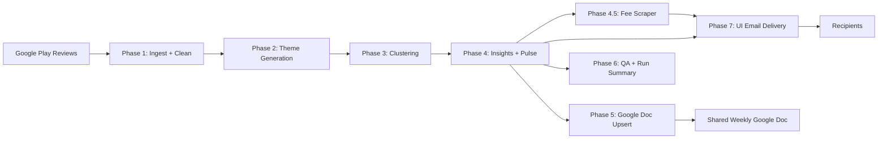

# Weekly Pulse MCP (`weeklypulsemcp`)

Beginner-friendly review intelligence pipeline for the Groww Android app.

It takes public Google Play reviews, turns them into a weekly pulse, writes the pulse to Google Docs, and lets an operator send HTML email from the UI.

---

## What this project does (plain English)

Every weekly run:

1. pulls latest app reviews
2. cleans and filters noisy text
3. groups reviews into themes
4. generates insights and a short weekly pulse
5. appends/updates one Google Doc block for that week
6. produces QA/run-summary artifacts

Then in the UI:

- operator picks a week
- enters recipient email(s) + token
- selects fee explainer funds
- sends email (MCP-only path)

---

## End-to-end flow

| Phase | What it does | Main output |
|---|---|---|
| Phase 1 | Ingestion + cleaning + filtering | `phase1_pipeline/outputs/*` |
| Phase 2 | Theming (LLM) | `phase2_theming/outputs/theme_runs_<week>.json` |
| Phase 3 | Clustering and mapping refinement | `phase3_clustering/outputs/*` |
| Phase 4 | Insights + pulse markdown | `phase4_insights/outputs/insights_<week>.json`, `pulse_<week>.md` |
| Phase 4.5 | Fee scraper | `phase4_5_fee_scraper/outputs/mf_fee_data_<week>.json` |
| Phase 5 | Google Doc append/update (pulse-only) | `phase5_delivery/outputs/doc_append_report_<week>.json` |
| Phase 6 | QA + run summary | `phase6_ops/outputs/run_summary_<week>.json` |
| Phase 7 | UI + API email send | Vercel `/` and `/api/*` |

Week tag format is `Month-WN-Year` (example: `March-W4-2026`).

---

## High-level architecture



For full detailed architecture, phase contracts, and deployment decisions, see [`Architecture.md`](./Architecture.md).

---

## Architecture at runtime

### GitHub Actions (scheduler)

- Runs Phases 1 to 6 on schedule (`Monday 11:00 AM IST / 05:30 UTC`)
- Uses `ubuntu-latest`
- Uses service-account auth for Google Docs append
- Can auto-commit generated output artifacts back to repo

### Vercel (UI + API)

- `public/index.html` serves the operator UI
- Python API (`api/index.py` -> `phase7_ui/api.py`) serves read/preview endpoints
- Node API (`api/deliver-node.js`) handles `POST /api/deliver` and sends email via Gmail MCP (`npx @gongrzhe/server-gmail-autoauth-mcp`)

---

## Project structure (high level)

- `phase1_pipeline/` ... `phase6_ops/`: backend pipeline phases
- `phase7_ui/`: shared UI/backend delivery logic
- `scheduler/`: CI scripts used by GitHub Actions
- `public/`: static frontend for Vercel
- `api/index.py`: Python Vercel entry
- `api/deliver-node.js`: Node Vercel email-delivery entry (MCP)
- `Architecture.md`: full design and operational details

---

## Local quick start

```bash
git clone https://github.com/sonal-dks/weeklypulsemcp.git
cd weeklypulsemcp
python3 -m venv .venv
source .venv/bin/activate
pip install -r requirements.txt
```

Set local `.env` values, then run:

```bash
export PYTHONPATH=.
python phase1_pipeline/scripts/run_phase1.py
python phase2_theming/scripts/run_phase2.py
python phase3_clustering/scripts/run_phase3.py
python phase4_insights/scripts/run_phase4.py
python -m phase4_5_fee_scraper.scripts.run_phase4_5
python phase5_delivery/scripts/run_phase5.py
python phase6_ops/scripts/run_phase6.py
```

Run local API/UI:

```bash
PYTHONPATH=. uvicorn phase7_ui.api:app --host 127.0.0.1 --port 8010
PYTHONPATH=. streamlit run phase7_ui/app.py --server.port 8507
```

---

## GitHub Actions setup (required)

Add these **Actions secrets**:

- `GROQ_API_KEY`
- `GEMINI_API_KEY`
- `GOOGLE_DOC_ID`
- `GOOGLE_SERVICE_ACCOUNT_JSON`
- `EMAIL_RECIPIENT`
- `DELIVERY_MODE` (`send` or `draft_only`)
- `GDOCS_MCP_TRANSPORT` (`stdio`)

Workflow file: `.github/workflows/weekly_pulse.yml`

---

## Vercel setup (required for Phase 7 email send)

Add these **Vercel env vars** (Production):

- `DELIVERY_TRIGGER_TOKEN`
- `GMAIL_CREDENTIALS_JSON_B64`
- either `GCP_OAUTH_KEYS_JSON_B64` **or** (`GOOGLE_CLIENT_ID` + `GOOGLE_CLIENT_SECRET`)

Optional:

- `GOOGLE_DOC_ID` (to include Doc link in response)

Then redeploy latest `main`.

---

## Security notes

- Never commit real `.env`, OAuth keys, service-account files, or Gmail credentials.
- Rotate keys immediately if leaked.
- Keep secrets only in GitHub Actions secrets / Vercel env vars.

---

## More details

- Full technical design and contracts: [`Architecture.md`](./Architecture.md)
